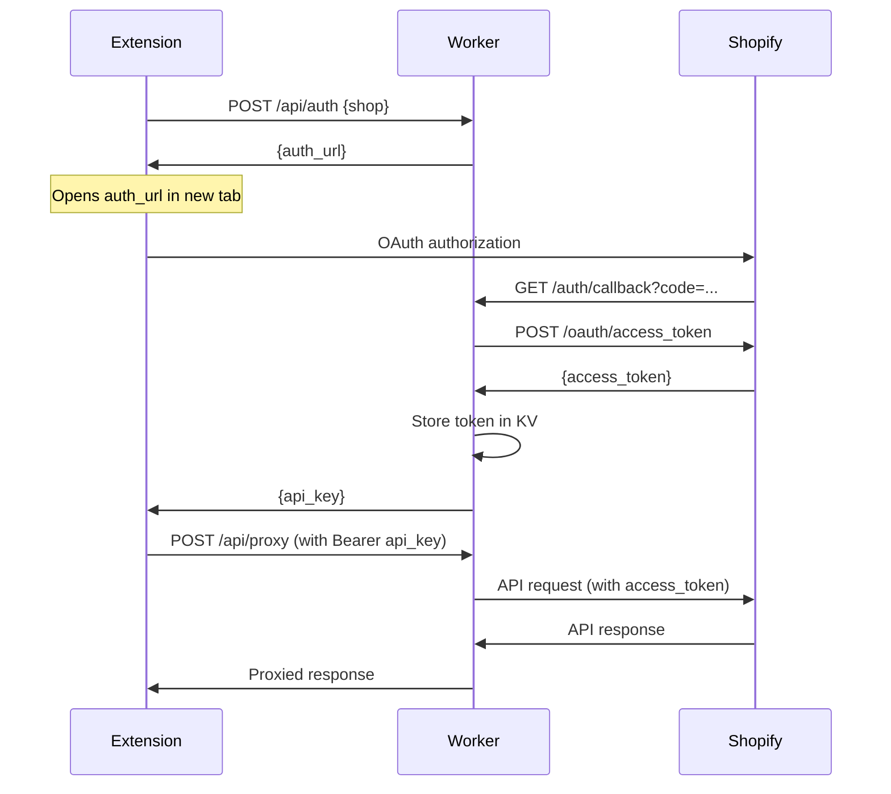

# Shopify OAuth Worker

[](https://github.com/JungleM0nkey/shopify-oauth-worker/actions/workflows/ci.yml)
[](https://github.com/JungleM0nkey/shopify-oauth-worker/actions/workflows/codeql.yml)

A Cloudflare Worker that provides OAuth authentication and API gateway for browser extensions to connect with Shopify storefronts.

**Why this exists:** Browser extensions (especially Chrome extensions) face iframe limitations when implementing OAuth flows. This worker acts as a bridge, handling the OAuth process server-side and providing secure API access to extensions.

## Features

- 🔐 **Complete OAuth 2.0 flow** - Handles Shopify app installation and authentication
- 🔑 **Secure token management** - Encrypted storage of access tokens in Cloudflare KV
- 🌐 **CORS-enabled API** - Browser extension friendly endpoints
- 🛡️ **HMAC verification** - Validates all Shopify webhooks and OAuth callbacks
- ⚡ **Edge computing** - Deployed globally on Cloudflare's network
- 📊 **Webhook support** - Handles mandatory GDPR compliance webhooks
- 🔄 **API proxy** - Secure proxy for Shopify Admin API calls

## Architecture

```
Browser Extension → Cloudflare Worker → Shopify Admin API
                         ↓
                  Cloudflare KV Storage
                  (Tokens & Sessions)
```

The worker provides a stateless authentication layer that manages OAuth flows and proxies API requests while maintaining security best practices.


## Quick Start

### Prerequisites

- [Cloudflare account](https://cloudflare.com) with Workers enabled
- [Shopify Partner account](https://partners.shopify.com) 
- [Node.js 18+](https://nodejs.org) for development
- [Wrangler CLI](https://developers.cloudflare.com/workers/wrangler/) installed globally

### 1. Clone and Setup

```bash
git clone https://github.com/JungleM0nkey/shopify-oauth-worker.git
cd shopify-oauth-worker
npm install
```

### 2. Create Cloudflare KV Namespaces

```bash
# Create the required KV namespaces
wrangler kv:namespace create "SHOPS"
wrangler kv:namespace create "AUTH_STATES" 
wrangler kv:namespace create "API_KEYS"
```

### 3. Configure wrangler.toml

Update `wrangler.toml` with your namespace IDs:

```toml
[[kv_namespaces]]
binding = "SHOPS"
id = "your-shops-namespace-id"

[[kv_namespaces]]
binding = "AUTH_STATES"
id = "your-auth-states-namespace-id"

[[kv_namespaces]]
binding = "API_KEYS"
id = "your-api-keys-namespace-id"

[vars]
SHOPIFY_APP_HANDLE = "your-app-handle"
APP_URL = "https://your-worker.workers.dev"
OAUTH_SCOPES = "read_products,write_orders"
SHOPIFY_API_VERSION = "2025-07"
```

### 4. Set Secrets

```bash
# Set your Shopify app credentials
wrangler secret put SHOPIFY_API_KEY
wrangler secret put SHOPIFY_API_SECRET
```

### 5. Deploy

```bash
# Deploy to Cloudflare Workers
wrangler deploy

# Or run locally for development
wrangler dev
```

## Configuration

### Shopify App Settings

In your [Shopify Partner dashboard](https://partners.shopify.com), create a new app with these settings:

- **App URL**: `https://your-worker.workers.dev/`
- **Allowed redirection URL**: `https://your-worker.workers.dev/auth/callback`
- **Required webhooks** (for GDPR compliance):
  - **Customer data request**: `https://your-worker.workers.dev/webhooks/customers/data_request`
  - **Customer redact**: `https://your-worker.workers.dev/webhooks/customers/redact`
  - **Shop redact**: `https://your-worker.workers.dev/webhooks/shop/redact`

### Environment Variables

| Variable | Description | Example |
|----------|-------------|---------|
| `SHOPIFY_APP_HANDLE` | Your app's handle from Partner Dashboard | `my-extension-app` |
| `APP_URL` | Your deployed worker URL | `https://my-worker.workers.dev` |
| `OAUTH_SCOPES` | Comma-separated list of required scopes | `read_products,write_orders` |
| `SHOPIFY_API_VERSION` | Shopify API version to use | `2025-07` |

### Secrets (via wrangler secret put)

| Secret | Description |
|--------|-------------|
| `SHOPIFY_API_KEY` | API key from your Shopify app |
| `SHOPIFY_API_SECRET` | API secret from your Shopify app |

## API Reference

### Endpoints

| Endpoint | Method | Description | Authentication |
|----------|--------|-------------|----------------|
| `/` | GET | App entry point (embedded or landing page) | None |
| `/auth` | GET | Initiate OAuth flow | None |
| `/auth/callback` | GET | OAuth callback handler | HMAC verified |
| `/api/auth` | POST | Generate API key for extensions | None |
| `/api/proxy` | POST | Proxy requests to Shopify API | Bearer token |
| `/webhooks/*` | POST | GDPR compliance webhooks | HMAC verified |

### Authentication Flow



## Extension Integration

### Browser Extension Setup

See the complete integration guide in [`extension/README.md`](./extension/README.md).

**Quick Example:**

```javascript
// 1. Authenticate with a Shopify store
const response = await fetch('https://your-worker.workers.dev/api/auth', {
  method: 'POST',
  headers: { 'Content-Type': 'application/json' },
  body: JSON.stringify({ shop: 'example-store.myshopify.com' })
});

const { api_key, auth_url } = await response.json();

if (auth_url) {
  // Open OAuth flow in new tab
  chrome.tabs.create({ url: auth_url });
  // Wait for OAuth completion...
}

// 2. Make authenticated API calls
const products = await fetch('https://your-worker.workers.dev/api/proxy', {
  method: 'POST',
  headers: {
    'Authorization': `Bearer ${api_key}`,
    'Content-Type': 'application/json'
  },
  body: JSON.stringify({
    endpoint: '/admin/api/2025-07/products.json',
    method: 'GET',
    params: { limit: 10 }
  })
});

const data = await products.json();
console.log('Products:', data.products);
```

### Supported Browsers

- ✅ Chrome (Manifest V2 & V3)
- ✅ Firefox (Manifest V2)  
- ✅ Edge (Manifest V2 & V3)
- ✅ Safari (with adapter)

## Development

### Local Development

```bash
# Install dependencies
npm install

# Run locally with hot reload
npm run dev

# Run tests
npm test

# Run tests with coverage
npm run test:coverage

# Lint code
npm run lint

# Format code
npm run format
```

### Testing

The project includes comprehensive test coverage:

- **Unit tests** - Test individual functions and modules
- **Integration tests** - Test complete API flows
- **HMAC verification tests** - Security validation
- **Mock utilities** - Simulate Cloudflare Workers environment

```bash
# Run all tests
npm test

# Run specific test file
npx vitest tests/unit/validation.test.js

# Run tests in watch mode
npm run test:watch
```

### Debugging

```bash
# View worker logs in real-time
wrangler tail

# Check KV storage contents
wrangler kv key list --namespace-id=YOUR_NAMESPACE_ID
wrangler kv key get "shop-domain.myshopify.com" --namespace-id=YOUR_NAMESPACE_ID

# Debug specific requests
curl -X POST https://your-worker.workers.dev/api/auth \
  -H "Content-Type: application/json" \
  -d '{"shop":"test-shop.myshopify.com"}'
```

### Project Structure

```
├── worker.js              # Main worker entry point
├── lib/                   # Core functionality modules
│   ├── handlers.js        # Request routing and handlers
│   ├── validation.js      # Input validation functions
│   ├── hmac.js           # HMAC verification utilities
│   ├── shopify.js        # Shopify API integration
│   ├── utils.js          # Common utility functions
│   ├── templates.js      # HTML template generation
│   ├── constants.js      # Application constants
│   ├── errors.js         # Custom error classes
│   └── error-handler.js  # Global error handling
├── tests/                 # Test suite
│   ├── unit/             # Unit tests
│   ├── integration/      # Integration tests
│   └── utils/            # Test utilities and mocks
├── extension/            # Browser extension client
├── pages/                # Static HTML pages
└── wiki/                 # Documentation
```

## Security

### HMAC Verification

All OAuth callbacks and webhooks are verified using HMAC-SHA256 signatures to ensure requests are genuine and haven't been tampered with.

### Token Storage

- Access tokens are encrypted and stored in Cloudflare KV
- API keys have configurable TTL (default: 90 days)
- Session states expire after 10 minutes

### Best Practices

- ✅ Always use HTTPS endpoints
- ✅ Validate all input parameters
- ✅ Implement proper error handling
- ✅ Monitor for unusual API patterns
- ✅ Regularly rotate API keys

## Troubleshooting

### Common Issues

| Issue | Cause | Solution |
|-------|-------|----------|
| OAuth loop/redirect issues | Incorrect redirect URL | Verify redirect URL matches exactly in Partner Dashboard |
| CORS errors in extension | Missing permissions | Add worker URL to `host_permissions` in manifest.json |
| Token expired errors | API key TTL exceeded | Generate new API key via `/api/auth` |
| HMAC verification failures | Clock skew or wrong secret | Check system time and API secret |
| Rate limiting | Too many requests | Implement backoff strategy in extension |

### Debug Mode

Enable debug logging by setting the `DEBUG` environment variable:

```toml
[vars]
DEBUG = "true"
```

### Support

- 📖 [Wiki Documentation](./wiki/)
- 🐛 [Issue Tracker](https://github.com/JungleM0nkey/shopify-oauth-worker/issues)
- 💬 [Discussions](https://github.com/JungleM0nkey/shopify-oauth-worker/discussions)

## Contributing

We welcome contributions! Please see [CONTRIBUTING.md](./CONTRIBUTING.md) for guidelines.

## License

This project is licensed under the MIT License - see the [LICENSE](./LICENSE) file for details.

## Acknowledgments

- [Cloudflare Workers](https://workers.cloudflare.com/) for the serverless platform
- [Shopify](https://shopify.dev/) for the comprehensive API
- The open-source community for inspiration and feedback

